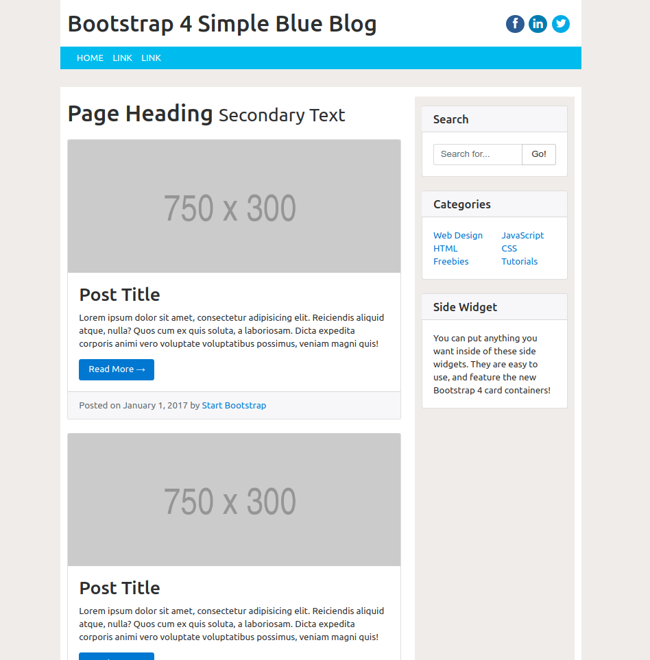
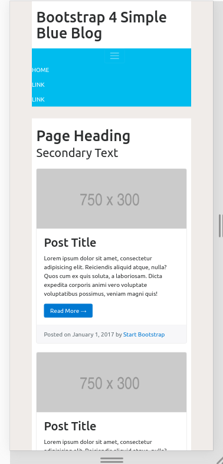

# bootstrap4-simple-blog-theme
A Bootstrap 4 simple responsive blog theme:
* Header on top of NavBar
* Two columns: content and sidebar
* Responsively Navbar will collabpse to "Hamburger icon"
* Responsively will collapse content/sidebar to single column view
* Nice warm and friendly blue color scheme

## Usage
Load the index.html into your browser from file system.

## Screenshot

Here is a desktop screenshot

Here is a mobile device screenshot

